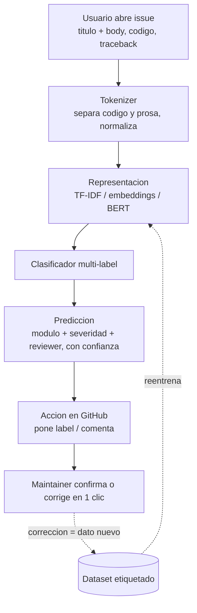

# Triaje Automático de Issues Open Source — Plan de Proyecto (Materia de NLP)

> Sistema que lee la descripción técnica de un issue/PR de un repositorio masivo
> (SciPy / PyMC) y predice el **módulo afectado** (y, como extensión, severidad y
> reviewer sugerido). El proyecto no se evalúa por el clasificador: se evalúa por
> la **tubería texto → significado** y por el razonamiento lingüístico detrás de
> cada decisión.

---

## 1. Tesis y pregunta de investigación

En una materia de NLP, el nivel no se demuestra fine-tuneando BERT (eso es leer
documentación). Se demuestra en cómo se trata un registro lingüístico difícil y
en entender *por qué* cada representación captura o pierde información. Por eso el
proyecto se organiza alrededor de una pregunta:

> **¿Cuánto del trabajo lo hace la representación del texto vs el modelo encima?
> ¿Qué nivel de NLP es suficiente para este dominio antes de que el costo de un
> transformer deje de pagarse?**

Toda la experimentación (la "escalera" de la sección 7) existe para responder esto
con números y con análisis de errores, no para perseguir SOTA.

**Por qué este dominio es la materia prima ideal:** los issues de GitHub no son
texto natural. Son code-switching constante entre prosa en inglés y código,
tracebacks de decenas de líneas, identificadores (`scipy.special.gammaln`,
`pm.sample`), markdown, paths, versiones, hashes, `@menciones` y `#1234`. Tratar
esto bien **es** la demostración de dominio; un `.lower().split()` lo destruye.

---

## 2. ¿Cómo funciona? Recorrido de un issue

**Hoy, sin el sistema.** Alguien abre un issue, por ejemplo
*"csr_matrix multiplication gives wrong result with complex dtype"*, con prosa, un
snippet para reproducir y un traceback que menciona `scipy/sparse/_compressed.py`.
Ese issue cae en una pila de miles, y un maintainer (voluntario, son pocos) tiene
que **leerlo, adivinar qué módulo toca, ponerle labels y decidir quién lo revisa**.
Ese triaje manual es el cuello de botella: issues que se quedan días o semanas sin
clasificar.

**Con el sistema, al abrirse el issue corre este flujo:**

1. **Ingesta.** Un webhook / GitHub Action en el evento `issues.opened` captura
   título + body.
2. **Preprocesamiento.** El tokenizer separa prosa de código, normaliza
   versiones/paths/hashes a tokens especiales, conserva identificadores
   informativos (`csr_matrix`, `complex`) y decide qué hacer con el traceback.
3. **Representación.** Convierte el texto en vectores (TF-IDF / embeddings / BERT
   según el nivel).
4. **Predicción.** El clasificador multi-label saca módulo (`sparse` con confianza
   alta, quizá `linalg` con baja), severidad estimada y reviewer sugerido (vía
   `git blame` de los archivos típicos del módulo).
5. **Acción.** Pega el label y/o comenta: *"módulo probable: sparse (0.92); revisor
   sugerido: @X"*.
6. **Humano.** El maintainer confirma o corrige en un clic.
7. **Feedback.** La corrección se vuelve dato etiquetado para la siguiente versión.



**Punto clave: es un asistente, no automatización total.** El sistema no decide
solo; quita el arranque en frío. Solo auto-etiqueta cuando va con confianza alta
(p. ej. >0.9) y deja lo dudoso para el humano. El maintainer pasa de "leer y
clasificar desde cero" a "confirmar o corregir en un clic", y esa corrección no se
desperdicia.

---

## 3. ¿Para qué sirve y cómo se usa?

El dolor es real y concreto: SciPy y PyMC tienen miles de issues abiertos y un
puñado de maintainers voluntarios. El triaje manual es el cuello de botella.

**Para qué sirve:**
- **Alivia el triaje** — los issues llegan pre-clasificados; el maintainer invierte
  tiempo arreglando, no ordenando.
- **Enruta al experto correcto** — quien sabe de `sparse` recibe los issues de
  sparse sin que nadie lo adivine.
- **Onboarding de nuevos contributors** — un label de módulo o "good first issue"
  ayuda al que llega a saber por dónde empezar.
- **Analítica del proyecto** — agregando los labels en el tiempo: qué módulos
  generan más bugs, dónde invertir mantenimiento. Se vuelve un dashboard.

**Cómo se usa en la práctica.** Empaquetado como **GitHub Action**: cualquiera lo
mete en su `.github/workflows/` y corre solo en cada issue nuevo. Esa es la vía de
entrega que lo lleva de "notebook de tarea" a algo instalable. La técnica
generaliza a cualquier repo grande, a Jira o a tickets de soporte — al final es
texto → categoría → enrutamiento, un patrón que se repite en mil lugares.

**Bonus de narrativa (para entrevistas):** es *la herramienta que te hubiera
gustado tener como contributor de PyMC/SciPy*. No es un proyecto de tutorial; es un
dolor real de un ecosistema en el que ya trabajas.

---

## 4. Objetivos

**Objetivo general.** Construir un sistema de triaje multi-label que clasifique
el módulo afectado de un issue, comparando representaciones clásicas implementadas
desde cero contra un transformer fine-tuneado, y caracterizar el trade-off.

**Objetivos específicos (lo que evalúa la materia).**
- Diseñar y defender un tokenizer para texto técnico mixto código/prosa.
- Implementar desde cero al menos un esquema de representación neuronal (BPE
  y/o word2vec) y conectar conceptualmente con cómo opera BERT.
- Comparar representaciones bajo un protocolo de evaluación honesto (split
  temporal) y hacer análisis de errores **lingüístico**, no solo métrico.
- Servir el modelo con dependencias mínimas como evidencia de criterio de
  ingeniería.

---

## 5. Datos

**Fuente.** API REST de GitHub (no scraping). Cliente con `urllib` de la stdlib +
token personal. Cero dependencias para la extracción, consistente con la filosofía
minimalista. GraphQL opcional si se busca eficiencia en paginación.

**Repositorios.** SciPy y PyMC (dominio en el que ya hay contexto real como
contributor). Issues + PRs cerrados y abiertos, ~20–30k por repo.

**Ground truth (clave).** En los PRs, los **archivos modificados dan el módulo
gratis**: `scipy/sparse/...` → label `sparse`. Esto permite *weak supervision*
para propagar etiquetas de módulo a los issues vía el PR que los cierra
(`Fixes #N`) y vía similitud léxica. La calidad de esta etiqueta débil se
documenta y se audita con una muestra manual.

**Campos a extraer.** título, body, labels, estado, fechas (open/close), número de
comentarios, reacciones, autor, asignados, PRs vinculados, archivos tocados (en
PRs), milestone.

**Entregable de datos.** Dataset curado versionado + un **datasheet** (motivación,
composición, proceso de recolección, sesgos conocidos, ToS respetados). Un dataset
bien documentado de issues etiquetados es una contribución por sí misma.

**Splits.** **Temporal, no aleatorio.** Train con issues hasta 2024, evaluación con
2025+. El split aleatorio filtra información (issues duplicados, vocabulario de
releases) e infla métricas; cualquier revisor técnico lo señala. Este punto se
justifica explícitamente en el reporte.

---

## 6. Tareas de clasificación (priorizadas)

1. **Módulo afectado** — *núcleo del proyecto.* Multi-label, bien definido, con
   ground truth gratis desde PRs. Es la tarea principal.
2. **Severidad** — *extensión con asterisco.* SciPy/PyMC no etiquetan severidad de
   forma consistente. Se aproxima con proxies (¿cierre rápido?, # comentarios/
   reacciones, ¿lo tomó un maintainer core?) y se documenta como **etiqueta débil**.
3. **Reviewer sugerido** — *opcional, heurística.* No es clasificación sino
   recomendación; con pocos reviewers activos se vuelve trivial o imposible. Se
   resuelve con `git blame` de los archivos tocados, no con un modelo.

---

## 7. La escalera de representaciones (corazón del proyecto)

Cada peldaño responde una pregunta de NLP y deja una evidencia concreta. Casi todo
from scratch sobre la base que ya existe (one-hot, BoW, co-occurrence, PCA, t-SNE
hechos solo con `math` y `random`).

| Peldaño | Concepto NLP | From scratch | Evidencia que se entrega |
|---|---|---|---|
| **Tokenizer técnico** | normalización, segmentación de registro | sí | tabla de decisiones + ejemplos antes/después |
| **BoW** | modelo de bolsa, pérdida de orden | sí (hecho) | matriz documento-término |
| **TF-IDF** | IDF como medida de información | sí | comparación de pesos vs BoW |
| **n-grams** | orden local | sí | "does not converge" vs "converge" |
| **BPE / subword** | OOV, puente clásico→transformer | sí | tabla de merges aprendidos |
| **word2vec (skip-gram + neg. sampling)** | hipótesis distribucional | sí | vecinos cercanos en espacio de dominio |
| **n-gram LM + smoothing** | modelado de lenguaje, perplejidad | sí | perplejidad bug vs feature |
| **BERT contextual** | atención, contexto | no (transformers) | probe de attention sobre traceback |

**Detalle de los peldaños firma:**

- **Tokenizer técnico.** Pre-tokenizer que separa código de prosa; normaliza
  versiones/paths/hashes a tokens especiales (`<VERSION>`, `<PATH>`, `<HASH>`)
  para no reventar el vocabulario; decisión explícita y argumentada sobre los
  tracebacks (¿señal o ruido? se prueban ambos). Es el peldaño más subestimado y
  donde más puntos se ganan.

- **BPE desde cero.** Resuelve el OOV que matan los identificadores
  (`csr_matrix`, `__init__`, `pm.sample`) y es el puente conceptual exacto hacia
  los transformers. Mostrar la tabla de merges sobre el corpus de código (aprende
  `np.`, `_matrix`, `__`, etc.) es evidencia visible de que se entiende el
  mecanismo.

- **word2vec desde cero.** Siguiente paso natural tras la co-occurrence matrix.
  Entrenado sobre el corpus de issues; se muestran vecinos de dominio
  (`NUTS`, `sampler`, `divergence`, `convergence` deben caer juntos). Se compara
  contra embeddings genéricos (GloVe) para mostrar **domain shift y polisemia**
  (`tape` = autodiff tape, no cinta).

- **BERT como contraste, no protagonista.** No solo fine-tunear: probar attention
  sobre un traceback, comparar frozen features vs fine-tuned, y **conectar
  explícitamente el BPE casero con por qué BERT maneja identificadores raros**.
  Ese "lo que implementé a mano es lo que hace funcionar al transformer" es la
  señal más clara de mastery.

**Núcleo obligatorio vs extensiones (para poder recortar alcance):**
- *Núcleo:* tokenizer + BoW/TF-IDF/n-grams + **uno** de {BPE, word2vec} a
  profundidad + BERT como contraste + análisis de errores.
- *Extensiones:* el segundo embedding neuronal, n-gram LM con Kneser-Ney,
  severidad por proxies, reviewer por heurística, GitHub Action.

---

## 8. Arquitectura de dos niveles

**Nivel 1 — baseline desde cero.** Tokenizer propio + TF-IDF/embeddings caseros +
**regresión logística multi-label en numpy**. Esto es lo que demuestra dominio.
Pesa kilobytes e infiere en microsegundos.

**Nivel 2 — transformer.** DistilBERT/ModernBERT fine-tuneado (más barato que BERT
base) como cota superior y objeto de comparación.

**Línea honesta sobre librerías (para defenderla con el profe):** la *lógica de
NLP* es from scratch (tokenizer, BPE, word2vec, TF-IDF, n-gram LM). `numpy` se usa
solo como motor de álgebra vectorizada para la logreg y el entrenamiento de
word2vec (en Python puro sería impráctico). `matplotlib` solo para EDA y visualizar
embeddings. `transformers`/`torch` viven exclusivamente en el Nivel 2.

---

## 9. ¿Cómo se demuestra que funciona? (validación y métricas)

La prueba no es una sola; son capas, de la más rigurosa a la más convincente para
un humano.

**1. Prueba dura — test temporal.** Apartas los issues de 2025+ que el modelo
nunca vio, corres tus predicciones y las comparas contra los labels que los
maintainers *sí* terminaron poniendo en la vida real. En cristiano: *"acierta el
módulo en X de cada 10 issues que vienen del futuro"*. Que sea split temporal y no
aleatorio es lo que hace creíble el número: simula predecir el futuro, no memorizar
el pasado.

**2. Prueba de que el NLP sirve — baselines y ablation.** Un número solo no dice
nada. Hay que ganarle a un tonto: a "siempre predice el módulo más común" y a un
match de keywords. Si no le ganas a eso, no está aprendiendo. La ablation
(TF-IDF vs word2vec vs BERT) prueba *dónde* está el valor. Hallazgo honesto: si
para clasificar módulo el TF-IDF casi empata a BERT, eso no es un fracaso, es tu
conclusión — pruebas que entendiste el problema.

**3. Prueba de que entiendes — análisis de errores en vivo.** Agarras issues
reales recientes, corres el modelo enfrente del jurado y muestras un caso que
acierta y uno que falla, explicando *por qué* falla (`scipy.sparse` vs
`scipy.linalg` comparten vocabulario). Poder explicar tus errores convence más que
solo enseñar aciertos. Esto separa un 8 de un 10.

**4. Prueba de que es usable — calibración.** Muestras que cuando el modelo va
confiado casi siempre acierta, y cuando duda, se abstiene y escala al humano. Eso
es lo que lo vuelve herramienta real, no juguete.

**5. Experimento estrella — acuerdo con maintainers reales.** Corre el sistema
sobre los últimos meses de issues del repo real y mide **qué tanto coincide con lo
que los maintainers hicieron de verdad**. Ese porcentaje de acuerdo es la prueba
más tangible que puedes presentar.

**Métricas concretas.** F1 macro y micro (macro importa porque hay módulos raros),
precision/recall por clase, Hamming loss y subset accuracy. Todo bajo el split
temporal de §5.

**Matriz experimental.** Cada celda (representación × tarea) responde una pregunta
de la tesis; se reporta como tabla de ablation.

**Análisis de errores lingüístico (lo que define el NLP).**
- Qué módulos se confunden entre sí por **vocabulario compartido**
  (`scipy.sparse` vs `scipy.linalg`).
- Un ejemplo concreto donde el **orden importa** y n-grams le gana a BoW.
- Un ejemplo donde el **contexto importa** y BERT le gana a n-grams.
- Casos donde el subword (BPE) rescata un issue lleno de identificadores raros.

---

## 10. Despliegue minimalista

Tres opciones, de menor a mayor "pureza", a elegir/combinar:

1. **ONNX + onnxruntime + `http.server`.** Exportar el modelo fine-tuneado a ONNX,
   cuantizar a int8, servir con la stdlib. Dos dependencias en producción, sin
   torch ni transformers. Reportar trade-off latencia/accuracy de la cuantización.
2. **Solo numpy en producción.** Correr únicamente el baseline (TF-IDF + logreg).
   El reporte justifica con números por qué el costo del transformer no se paga.
   Criterio de ingeniería, no solo ML.
3. **GitHub Action (endgame).** Empaquetar como Action que etiqueta issues nuevos
   automáticamente. Si funciona, se puede proponer en un repo real → impacto
   verificable, no solo portafolio.

---

## 11. Entregables

- **Repositorio** con código limpio (estructura en §13) y `README` reproducible.
- **Dataset curado** + `datasheet.md`.
- **Notebooks** numerados: EDA, tokenizer, representaciones, experimentos, errores.
- **Modelos**: baseline numpy serializado + checkpoint del transformer + export ONNX.
- **Reporte técnico** (estructura en §12).
- **Servicio de inferencia** (una de las tres opciones de §10).
- *(Extensión)* GitHub Action funcional.
- **Presentación** para la defensa en clase.

---

## 12. Estructura del reporte

1. Introducción y motivación (el dominio y por qué su lenguaje es difícil).
2. Pregunta de investigación e hipótesis.
3. Trabajo relacionado (triaje de bugs, clasificación de texto técnico, subword).
4. Datos (recolección, weak supervision, datasheet, split temporal).
5. Metodología (tokenizer, escalera de representaciones, dos niveles).
6. Experimentos y resultados (matriz de ablation).
7. Análisis de errores lingüístico.
8. Despliegue y trade-offs.
9. Conclusiones (respuesta a la pregunta de investigación) y trabajo futuro.

---

## 13. Estructura del repositorio

```
issue-triage-nlp/
├── README.md
├── requirements.txt
├── data/
│   ├── raw/                 # JSON crudo de la API (gitignored)
│   ├── processed/           # dataset curado + splits temporales
│   └── datasheet.md
├── src/
│   ├── extract/             # cliente GitHub API (urllib, stdlib)
│   ├── preprocess/          # tokenizer, normalización, segmentación código/prosa
│   ├── representations/
│   │   ├── bow.py
│   │   ├── tfidf.py
│   │   ├── ngrams.py
│   │   ├── bpe.py           # from scratch
│   │   ├── word2vec.py      # skip-gram + negative sampling, from scratch
│   │   └── ngram_lm.py      # + smoothing
│   ├── models/
│   │   ├── logreg.py        # numpy, multi-label
│   │   └── bert_finetune.py # transformers (solo este nivel)
│   ├── eval/                # métricas multi-label, split temporal, error analysis
│   └── serve/               # onnxruntime + http.server
├── notebooks/
│   ├── 01_eda.ipynb
│   ├── 02_tokenizer.ipynb
│   ├── 03_representations.ipynb
│   ├── 04_experiments.ipynb
│   └── 05_error_analysis.ipynb
├── report/
│   └── reporte.md           # o .tex
└── action/                  # GitHub Action (extensión)
```

---

## 14. Stack y dependencias

- **Núcleo from scratch:** `math`, `random`, `re`, `json`, `urllib`, `collections`
  (stdlib) + `numpy` como motor de álgebra.
- **EDA/visualización:** `matplotlib` (no toca el core de NLP).
- **Nivel transformer:** `transformers`, `torch` (o `datasets`).
- **Despliegue:** `onnxruntime` + `http.server` (stdlib).

La separación es deliberada y se documenta: producción puede correr con ≤2
dependencias.

---

## 15. Cronograma por fases

Estimaciones de esfuerzo en "bloques"; mapear a las semanas reales que queden de la
materia (el núcleo cabe en ~5–6 semanas; las extensiones suman si hay tiempo).

| Fase | Contenido | Esfuerzo |
|---|---|---|
| **0. Datos** | cliente API, extracción, dataset curado, datasheet, splits temporales | 1 bloque |
| **1. Tokenizer** | segmentación código/prosa, normalización, decisiones documentadas | 1 bloque |
| **2. Clásicas** | BoW, TF-IDF, n-grams + baseline logreg numpy | 1 bloque |
| **3. Neuronales from scratch** | BPE y/o word2vec + visualización de embeddings | 1–2 bloques |
| **4. Transformer** | fine-tuning DistilBERT/ModernBERT + probe de attention | 1 bloque |
| **5. Experimentos** | matriz de ablation + análisis de errores lingüístico | 1 bloque |
| **6. Despliegue** | ONNX/numpy + (opcional) GitHub Action | 0.5–1 bloque |
| **7. Reporte + defensa** | redacción y presentación | 1 bloque |

---

## 16. Riesgos y mitigaciones

- **Etiquetas de severidad ruidosas** → tratarlas como débiles, basadas en proxies,
  y documentarlo; no presentarlas como ground truth.
- **Weak supervision sesgada** (no todo issue tiene PR vinculado) → auditar una
  muestra manual y reportar cobertura/precisión del etiquetado automático.
- **Rate limits de la API** → caché local del JSON crudo, extracción incremental.
- **Desbalance de clases** (módulos raros) → métricas macro, posible weighting;
  reportar el desbalance en el EDA.
- **Sobre-ingeniería / no terminar** → respetar el "núcleo obligatorio" de §7 y
  tratar todo lo demás como extensión.

---

## 17. Rúbrica interna: qué busca un profesor de NLP

- ¿Puedes **justificar** cada decisión del tokenizer con un ejemplo?
- ¿Puedes **predecir dónde falla** cada representación antes de correrla?
- ¿Conectas lo **clásico con lo neuronal** (tu BPE ↔ subword de BERT)?
- ¿Tu evaluación es **honesta** (split temporal) y tu análisis es **lingüístico**?
- ¿La densidad de razonamiento por decisión es alta, o solo apilas técnicas?

Si esas cinco están cubiertas, el nivel queda demostrado independientemente del
accuracy final.
